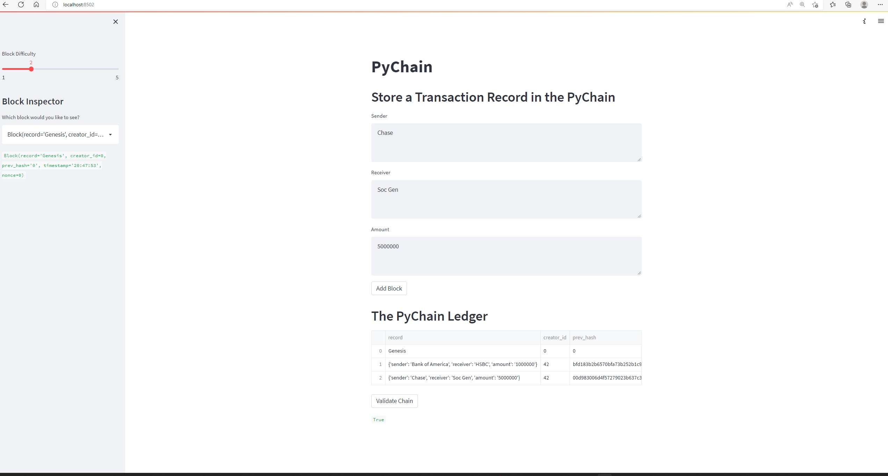

# Challenge_18_BlockChain_Creation_Application
The objective of this challenge was to build a blockchain based ledger system, complete with a user-friendly web interface.

---
## Technologies
The programming language used for this analysis was **Python (v 3.9.7)**.

The applicable software needed to run this analysis are:

` 1. streamlit 2. dataclass 3. datetime 4. pandas 5. hashlib `

---
## Contribution 
James Handral

James.Handral@gmail.com

---
## License

N/A

---

## Challenge Summary 
1. Create a Record Data Class
2. Modify the Existing Block Data Class to Store Record Data
3. Add Relevant User Inputs to the Streamlit Interface
4. Test the PyChain Ledger by Storing Records

---
### Screenshot and Recording of Completed BlockChain Based Ledger System

[Recording](https://screenrec.com/share/s3cKhBEfT9)

---

**link to the pychain .py file**

[Pychain_file](./pychain.py)